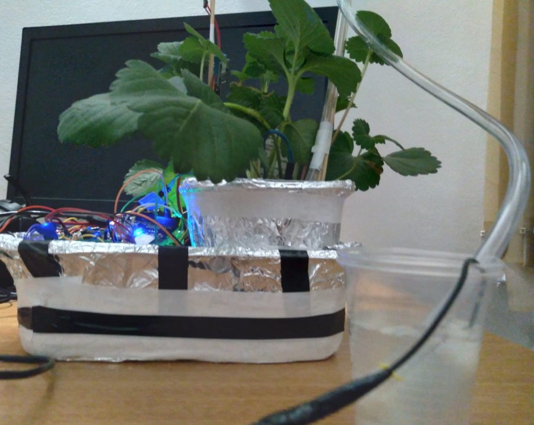

# TheSproutGuardian-ESP32-code
 
This section presents the ESP32 (ESPDUINO) board code used in the hardware component. 
The accompanying software application (desktop application) can be accessed via the following link: 
(https://github.com/andrei-crisu/TheSproutGuardian)
  

## Hardware parts used

### ESPduino 32 (ESP32 WiFi)
Description: The ESP32 development board with built-in WiFi capabilities.

    

  

### Submersible Water Pump
Description: This water pump is used for automatic irrigation in the Sprout Guardian system.

    

  

### Battery Plug Connector 9V
Description: This is a plug connector specifically designed for connecting the 9V battery.

    

  

### Battery 9V
Description: This is a 9V battery used to power the Sprout Guardian system.

    

  

### Photoresistor
Description: The photoresistor used in the Sprout Guardian system.

    

  

### DHT11
Description: The DHT11 sensor provides temperature and humidity measurements in the Sprout Guardian system.

    

  

### Moisture Sensor
Description: A moisture sensor used to measure the soil moisture level in the Sprout Guardian system.

    

  

### Mini Breadboard (170 points)
Description: A small breadboard with 170 points for prototyping and connecting components.

    

  

### Relay Module
Description: This module allows control of high-voltage devices using the ESP32 board.

    

  

### Breadboard Jumper Wire Set
Description: A set of jumper wires used for making connections on the breadboard.

    

   

## Visual Representation of the Project
  

    

  

    

  

    

  

    

  

    

  

